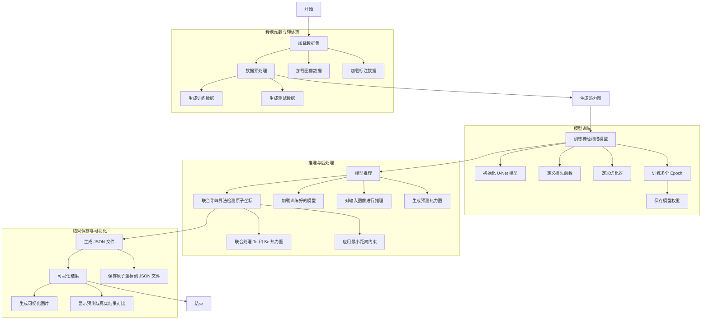

# PyTorch Project for STM Image Analysis

This project implements a deep learning pipeline using PyTorch for analyzing Scanning Tunneling Microscopy (STM) images. The goal is to detect and locate atomic structures within STM images by generating heatmaps and training a U-Net model.

## Project Structure

The project is organized as follows:

```
pytorch-project
├── data
│   ├── images          # Directory containing raw STM images
│   └── labels          # Directory storing generated heatmap labels
├── src
│   ├── dataset.py      # Defines the FeTeSeDataset class for loading images and labels
│   ├── generate_heatmaps.py  # Script for generating heatmap labels from JSON annotations
│   ├── train.py        # Training script for the U-Net model
│   ├── test.py         # Testing script for evaluating the trained model
│   └── models
│       └── unet.py     # Implementation of the U-Net architecture
├── requirements.txt     # Lists project dependencies
└── README.md            # Documentation for the project
```

## Installation

To set up the project, clone the repository and install the required dependencies:

```bash
pip install -r requirements.txt
```

## Data Preparation

1. **STM Images**: Place your raw STM images in the `data/images` directory. Each image should be in PNG format and sized 512x512 pixels.
2. **Annotations**: Create JSON files containing the coordinates and classes of the atoms in each image. The format should be as follows:

```json
{
  "image_001.png": [
    {"x": 30, "y": 40, "class": "Te"},
    {"x": 60, "y": 100, "class": "Se"}
  ],
  "image_002.png": [
    {"x": 28, "y": 38, "class": "Te"}
  ]
}
```

3. **Generate Heatmaps**: Run the `generate_heatmaps.py` script to convert the JSON annotations into heatmap labels saved as `.npy` files in the `data/labels` directory.

## Training the Model

To train the U-Net model, execute the following command:

```bash
python src/train.py
```

This script will load the images and heatmaps, set up the model, and begin training. The trained model will be saved in the `checkpoints` directory.

$$


$$

## Testing the Model

After training, you can test the model using:

```bash
python src/test.py
```

This script will load the trained model, process test images, and output the predicted heatmaps along with the detected atomic coordinates.

## Requirements

The project requires the following Python packages:

- torch
- torchvision
- numpy
- opencv-python
- matplotlib

You can install these packages using the provided `requirements.txt`.

## Conclusion

This project provides a comprehensive framework for analyzing STM images using deep learning techniques. You can customize the model architecture, training parameters, and data processing methods to suit your specific needs. Happy coding!



